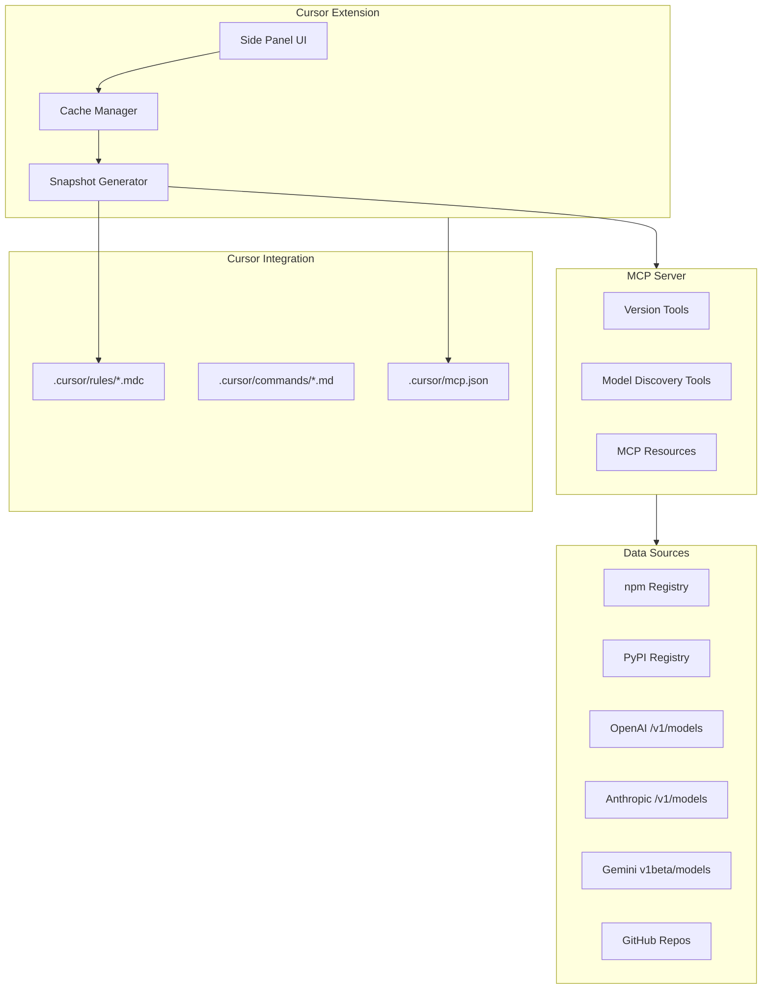

# Codegen Preflight Tool for Cursor

## Problem Being Solved

Agentic coding IDEs generate "wrong-on-day-one" code because they lack current world-state awareness: latest SDK versions, valid model IDs, and current best practices. This tool creates a daily-refreshed context snapshot that Cursor injects into every codegen session.

## Architecture Overview




## Component Breakdown

### 1. MCP Server (codegen-preflight-mcp)

A Node.js MCP server providing tools and resources:**Tools:**

- `get_latest_versions` - Query npm/PyPI for latest package versions
- `list_llm_models` - Query provider APIs for available models
- `get_sdk_codegen_instructions` - Fetch codegen instructions from SDK repos (e.g., Google's python-genai)
- `generate_snapshot` - Create complete state-of-the-world JSON

**Resources:**

- `preflight://snapshot/current` - Current day's cached snapshot
- `preflight://packages/{ecosystem}` - Latest versions for npm/pypi packages
- `preflight://models/{provider}` - Available models per provider

### 2. Cursor Extension (codegen-preflight-extension)

A VS Code/Cursor extension with:**Side Panel UI:**

- Display current snapshot timestamp and freshness
- Show latest SDK versions (React, Next.js, openai, anthropic, google-genai, etc.)
- Show selected default models per category (reasoning, fast, vision)
- Force refresh button
- Settings for watched packages and providers

**Extension Features:**

- Use `vscode.cursor.mcp.registerServer()` to programmatically register the MCP server
- Auto-refresh snapshot at session start if older than 24 hours
- Generate/update `.cursor/rules/01-version-snapshot.mdc` file
- Provide commands: `/preflight`, `/preflight-force-refresh`

### 3. Cursor Rules Integration

**Auto-generated rule (`.cursor/rules/01-version-snapshot.mdc`):**

```javascript
---
alwaysApply: true
description: "AUTO-GENERATED: Version + model snapshot for codegen freshness"
---
# Version and Model Snapshot
Generated: {ISO timestamp}

## Selected Default Models
{JSON with reasoning/fast/vision picks per provider}

## Latest SDK Versions
### npm
{package: version pairs}

### PyPI  
{package: version pairs}

## Codegen Rules
- Use selected models unless user specifies otherwise
- Use latest SDK versions for new installs
- Never invent model IDs not in the snapshot
```

**Static policy rule (`.cursor/rules/00-version-preflight.mdc`):**

- Instructs the agent to follow the snapshot
- Triggers refresh if snapshot is stale/missing

### 4. Data Sources and Integration

**Package Registries:**

- npm: `https://registry.npmjs.org/{package}` for dist-tags.latest
- PyPI: `https://pypi.org/pypi/{package}/json` for info.version

**LLM Provider APIs:**

- OpenAI: `GET /v1/models` with Bearer auth
- Anthropic: `GET /v1/models` with x-api-key header  
- Gemini: `GET https://generativelanguage.googleapis.com/v1beta/models` with x-goog-api-key

**SDK Codegen Instructions:**

- Clone/fetch from googleapis/python-genai and similar repos
- Use Repomix to extract relevant codegen instruction files
- Parse and include key guidance in snapshot

### 5. Watched Packages (Default Set)

**npm:**

- `next`, `react`, `react-dom`
- `openai`, `@anthropic-ai/sdk`, `@google/genai`
- `typescript`, `zod`, `tailwindcss`

**PyPI:**

- `openai`, `anthropic`, `google-genai`, `litellm`
- `fastapi`, `pydantic`, `httpx`

### 6. Model Selection Policy

Deterministic regex-based selection from discovered models:| Category | OpenAI Pattern | Anthropic Pattern | Google Pattern ||----------|----------------|-------------------|----------------|| reasoning | `gpt-5.2.*thinking` | `claude-opus-4` | `gemini-3-pro` || fast | `gpt-5.*mini` | `claude-sonnet-4` | `gemini-3-flash` || vision | `gpt-5.2` | `claude-opus-4` | `gemini-3-pro` |

## Implementation Approach

### Phase 1: MCP Server Core

Build the MCP server with version querying tools and model discovery, outputting to stdout (STDIO transport). Test with Cursor's MCP integration directly.

### Phase 2: Snapshot Generation

Implement the snapshot generator that combines all data sources into a single JSON, then formats it as a Cursor rule file.

### Phase 3: Extension Shell

Create the VS Code extension structure with side panel webview, cache management, and MCP server lifecycle management.

### Phase 4: Cursor Integration

Wire up the extension to auto-generate rules, register MCP server programmatically, and provide `/preflight` command.

### Phase 5: Enhanced Features

Add Context7 integration for live documentation lookup, Repomix for SDK analysis, and LiteLLM model catalog support.

## Key Files to Create

```javascript
codegen-preflight/
  package.json                    # Monorepo root
  packages/
    mcp-server/
      package.json
      src/
        index.ts                  # MCP server entry
        tools/
          versions.ts             # Package version tools
          models.ts               # LLM model discovery
          codegen-instructions.ts # SDK codegen parser
        resources/
          snapshot.ts             # Snapshot resource provider
    extension/
      package.json
      src/
        extension.ts              # Extension entry
        sidePanel.ts              # Webview provider
        snapshotManager.ts        # Cache and generation
        mcpRegistration.ts        # vscode.cursor.mcp integration
      media/
        panel.html                # Side panel UI
        panel.css
        panel.js
  .cursor/
    rules/
      00-version-preflight.mdc    # Static policy
    commands/
      preflight.md                # /preflight command
    mcp.json                       # MCP server config
```


## Open Questions for Clarification

1. **Scope of packages**: Should the default watched package list be configurable per-project, or is a global default sufficient for v1?
2. **LLM provider priority**: Which providers should be mandatory vs optional? (The script currently requires API keys to be set for model discovery)