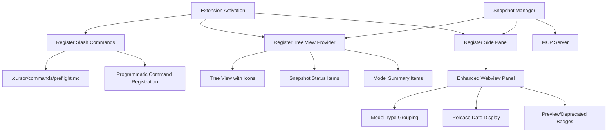

# Cursor Extension UI/UX Enhancement & Slash Command Fix

## Overview

This plan addresses multiple issues:

1. Fix `/preflight` slash command execution
2. Add airplane/paper airplane icon to sidebar
3. Enhance tree view with detailed snapshot information
4. Update side panel to display all enhanced model metadata
5. Improve overall extension UI/UX

## Architecture




## Implementation Tasks

### 1. Fix `/preflight` Slash Command

**Files to modify:**

- [`.cursor/commands/preflight.md`](.cursor/commands/preflight.md) - Verify format
- [`packages/extension/src/extension.ts`](packages/extension/src/extension.ts) - Add programmatic registration if needed

**Changes:**

- Verify slash command format matches Cursor's expected structure
- Ensure command file is properly recognized by Cursor
- Add programmatic command registration as fallback using `vscode.commands.registerCommand` with proper command ID
- Test command execution in Cursor chat

**Research needed:**

- Check if Cursor requires specific metadata in command files
- Verify if commands need to be registered in `package.json` contributions
- Test if commands work when placed in workspace `.cursor/commands/` vs extension directory

### 2. Add Airplane Icon to Sidebar

**Files to modify:**

- [`packages/extension/package.json`](packages/extension/package.json) - Add icon configuration
- [`packages/extension/src/extension.ts`](packages/extension/src/extension.ts) - Set icon in tree view

**Changes:**

- Add `icon` property to view contribution in `package.json`:
  ```json
      "views": {
        "explorer": [{
          "id": "codegenPreflight",
          "name": "Codegen Preflight",
          "icon": "$(airplane)" // or custom icon path
        }]
      }
  ```


- If custom icon needed, create SVG icon file in `packages/extension/media/` and reference it
- Update `PreflightTreeItem` to use airplane icon for root item

**Icon options:**

- Use built-in VS Code icon: `$(airplane)` or `$(rocket)`
- Create custom SVG: paper airplane icon in `media/airplane.svg`
- Reference custom icon: `iconPath: vscode.Uri.joinPath(extensionUri, 'media', 'airplane.svg')`

### 3. Enhance Tree View with Detailed Information

**Files to modify:**

- [`packages/extension/src/extension.ts`](packages/extension/src/extension.ts) - Enhance `PreflightTreeDataProvider`

**Changes:**

- Expand tree structure to show:
- **Root**: Snapshot status with timestamp
- **Models**: Collapsible section showing:
    - Total count
    - By type (Chat, Image, Audio, Embedding)
    - By provider (OpenAI, Anthropic, Google)
- **SDKs**: Collapsible section showing:
    - npm packages count
    - PyPI packages count
- **Selected Models**: Quick view of reasoning/fast/vision defaults
- **Status indicators**: Fresh/Stale badges, API key status

**Tree item structure:**

```javascript
Codegen Preflight (airplane icon)
├─ Snapshot: Fresh (2h ago) [green dot]
├─ Models (175)
│  ├─ Chat (131)
│  ├─ Image (15)
│  ├─ Audio (20)
│  └─ Embedding (9)
├─ SDKs
│  ├─ npm (9 packages)
│  └─ PyPI (7 packages)
└─ Selected Models
   ├─ Reasoning: gpt-5.2-pro (2025-12-11)
   ├─ Fast: gpt-5.1-codex-mini
   └─ Vision: gpt-5.2-pro (2025-12-11)
```

**Implementation:**

- Create different tree item types: `SnapshotItem`, `ModelCategoryItem`, `SDKItem`, `SelectedModelItem`
- Add icons to each item type
- Add context menu actions (refresh, configure, etc.)
- Implement `onDidChangeTreeData` event emitter for real-time updates

### 4. Update Side Panel with Enhanced Model Information

**Files to modify:**

- [`packages/extension/src/sidePanel.ts`](packages/extension/src/sidePanel.ts) - Update webview HTML and data structure

**Changes:**

- Update `Snapshot` type to include all enhanced fields:
  ```typescript
      models: {
        discovered: Array<{
          provider: string;
          model_id: string;
          display_name?: string;
          release_date?: string;
          is_preview?: boolean;
          is_deprecated?: boolean;
          model_type?: 'chat' | 'image' | 'embedding' | 'audio' | 'other';
        }>;
        selected: Record<string, Record<string, string | null>>;
      };
  ```


- Enhance webview HTML to display:
- **Model grouping by type** with expandable sections
- **Release dates** next to each model
- **Preview badges** for preview models
- **Deprecated warnings** for deprecated models
- **Model type filters** (show only Chat, Image, etc.)
- **Search/filter functionality** for models
- **Provider badges** (OpenAI, Anthropic, Google)
- Add sections:
- Model discovery summary (total, by type, by provider)
- Selected models with release dates
- Model type breakdown with counts
- Deprecated models warning section
- Preview models section

**UI improvements:**

- Add collapsible sections for each model type
- Add color coding: preview (yellow), deprecated (red), stable (green)
- Add tooltips showing full model information
- Add copy-to-clipboard for model IDs
- Add "Use this model" quick actions

### 5. Add Cursor SDK Integration (if available)

**Research:**

- Check if Cursor exposes extension API for slash commands
- Look for `vscode.cursor` namespace with command registration
- Check for event hooks (before plan mode, chat start, etc.)

**Files to check:**

- [`packages/extension/src/extension.ts`](packages/extension/src/extension.ts) - Already has `cursorApi` check
- Research Cursor-specific APIs for:
- Slash command registration
- Plan mode hooks
- Chat event listeners

**Implementation:**

- If SDK available, use it for:
- Registering slash commands programmatically
- Hooking into plan mode events
- Listening to chat/composer events
- If not available, document workarounds

### 6. UI/UX Polish

**Files to modify:**

- [`packages/extension/src/sidePanel.ts`](packages/extension/src/sidePanel.ts) - CSS improvements
- [`packages/extension/src/extension.ts`](packages/extension/src/extension.ts) - Tree view styling

**Improvements:**

- Add loading states during snapshot refresh
- Add error states with retry buttons
- Add success notifications
- Improve color scheme for dark/light themes
- Add keyboard shortcuts
- Add tooltips throughout
- Add status bar item showing snapshot age
- Add quick actions in tree view context menu

## Testing Checklist

- [ ] `/preflight` command works in Cursor chat
- [ ] Airplane icon appears in sidebar
- [ ] Tree view shows all enhanced information
- [ ] Side panel displays release dates, preview badges, model types
- [ ] Model filtering works in side panel
- [ ] Context menus work in tree view
- [ ] Extension works in both light and dark themes
- [ ] All commands are accessible
- [ ] Snapshot refresh updates UI in real-time

## Files Summary

**New files:**

- `packages/extension/media/airplane.svg` (if custom icon needed)

**Modified files:**

- `.cursor/commands/preflight.md` - Fix command format
- `packages/extension/package.json` - Add icon, enhance contributions
- `packages/extension/src/extension.ts` - Enhance tree provider, add icons
- `packages/extension/src/sidePanel.ts` - Update webview with enhanced data

**Dependencies:**